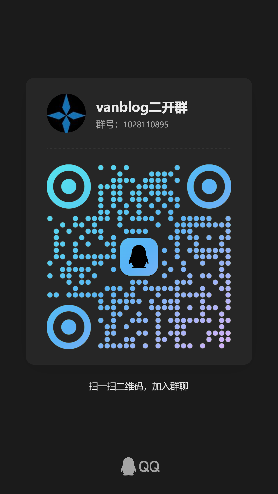

<p align="center">
	VanBlog 是一款功能强大、易于使用的个人博客系统，支持全自动按需申请 HTTPS 证书、黑暗模式、移动端自适应以及评论功能。它内置了流量统计和图床，并集成了评论系统。此外，VanBlog 还具有无限的可扩展性，提供完备的后台管理面板，支持黑暗模式、移动端、一键上传剪贴板图片到图床，并带有强大的编辑器。
</p>


## 介绍

原项目地址： https://github.com/Mereithhh/vanblog

原项目协议：GPL-3.0 协议

二次开发继承协议：GPL-3.0 协议

二次开发说明：优化一些我自己认为不好使用的点，自己动手，丰衣足食啊。

我的博客地址： https://www.dong-blog.fun/


## vanblog二开群

可以进群提BUG或者功能点：



## 我的二次开发进展内容

本项目基于 VanBlog 进行二次开发，主要进行了以下优化（只适应于我自己）:

- ✅ 使用Docker Compose一键启动启动项目
- ✅ 关闭Caddy的自动获取证书，使用Caddyfile而不是caddy json
- ✅ 文章标题显示完整，不再截断
- ✅ 不再显示网站运行时间和PowerBy的字样
- ✅ 默认关闭评论系统

和评论系统有关的位置的代码：
- 文件: packages/website/utils/getLayoutProps.ts
- 文件: packages/server/src/controller/admin/meta/meta.controller.ts
- 文件: packages/server/src/provider/analysis/analysis.provider.ts
- 文件: packages/admin/src/components/SiteInfoForm/index.tsx

- ✅ admin静态网页的Dockerfile地址写为https://registry.npmmirror.com
- ✅ 后台看文章列表的宽度显示进行优化，文章标题不省略显示，标题栏和标签栏均可换行显示

和宽度显示有关的代码：
- packages/admin/src/pages/Article/columns.jsx - 文章管理
- packages/admin/src/pages/Draft/columes.jsx - 草稿管理

- ✅ 移除对外部api依赖，版本对我来说不重要，直接修改此文件：packages/server/src/utils/getVersion.ts
- ✅ 这个分支本身是修复了Mermaid了的，现在Mermaid是可以正常使用的
- ✅ amdin后台每页显示的文章数量默认改为200

与每页显示多少文章有关的代码：
- packages/admin/src/pages/Article/index.jsx - 文章管理页面
- packages/admin/src/pages/Draft/index.jsx - 草稿管理页面

- ✅ 我习惯打开显示分类导航栏，但我的分类太多的时候，前端第二行不会换行显示。我更改了这一点。控制代码在`packages/website/components/NavBar/index.tsx` , 移除固定高度限制, 添加换行支持, 优化间距

- ✅ 我作为admin人员，在后台登录过，那么查看文章无需输入密码
- ✅ 前端代码块最多显示15行，增加展开代码和收起代码的按钮功能
- ✅ 添加智能代码块功能，记住用户上次使用的编程语言
- ✅ 禁用KaTeX严格模式以支持LaTeX公式中的Unicode字符
- ✅ mermaid渲染，在白色主题和暗色主题下都镜像修改配色。
- ✅ 增加个人动态页面。自行增加/moment页面即可。
- ✅ 为分类管理添加排序功能。
- ✅ 添加首页文章数量自定义设置功能。
- ✅ 添加浏览量管理功能。以前还有人炫自建博客浏览量，数据嘛，还不是想改就改，484~。
- ✅ admin数据看板优化。
- ✅ 联系方式重构，可以自定义上传联系方式图标并进行显示。
- ✅ add：轻量导航应用。
- ✅ add：使用AI为文章打标。
- ✅ 重构标签获取机制，重构一些加载机制从而加速。
- ✅ 优化博客的渲染机制。
- ✅ feat: 新增动画效果配置页面，优化粒子和心形爆炸动画
- ✅ feat: 新增音乐模块
- ✅ feat: 添加全站隐私设置功能
- ✅ feat: admin登录页面显示备案信息

## 原项目特性

- **极致的响应速度**：Lighthouse 接近满分，性能卓越。
- **全自动 HTTPS 支持**：无需手动配置域名，即可实现按需申请 HTTPS 证书。
- **完整的前后端和服务端**：从前端到后端，再到服务端，全部集成。
- **响应式设计**：前台和后台都为响应式设计，完美适配移动端和多尺寸设备。
- **黑暗模式支持**：前台和后台均支持黑暗模式，并可自动切换。
- **静态网页（SSG）**：前台为静态网页，支持秒级的增量渲染。
- **SEO 和无障碍友好**：支持自定义文章路径，提升搜索引擎优化和无障碍体验。
- **内置分析功能**：可统计访客等数据，帮助您了解访问情况。
- **内嵌评论系统**：支持用户评论，增强互动性。
- **强大的 Markdown 编辑器**：支持多种功能，提升内容创作效率。
- **内置图床**：支持多种图床配置，方便图片管理。
- **图片处理**：支持图片水印和压缩，提升用户体验。
- **脚本一键部署**：支持 ARM 平台，简化部署流程。


## 整体架构

VanBlog 分为以下几个部分，构建后将整合到一个 `docker` 容器内：

- **website**: VanBlog 默认的主题，使用了 `Next.js` 框架，有运行时。
- **server**: VanBlog 的后端服务，有运行时。
- **waline**: VanBlog 内嵌的评论服务，有运行时。
- **admin**: VanBlog 后台面板，打包后为静态页面，无运行时。
- **caddy**: 作为对外的网关，按照规则反代上述几个服务，并提供全自动的 HTTPS。

### 进程依赖和启动关系

打包后，启动关系如图所示：


架构图说明了：

- entrypoint.sh 是整个项目的启动入口
- caddy 作用是反代，证书管理（已经被二次开发关闭），把"admin 静态页面"也用caddy路由代理
- server 下面是website 和 waline （已经被二次开发默认关闭）

### 路径结构

本项目采用了 `pnpm` 作为包管理器，项目使用 `monorepo(pnpm workspace)` 组织和管理。

精简版目录结构：

```bash
├── docker-compose  # Docker Compose 编排
├── Dockerfile      # Dockerfile
├── docs            # 项目文档的代码
├── entrypoint.sh   # 容器入口文件
├── LICENSE         # 开源协议
├── package.json
├── packages        # 代码主体
|  ├── admin        # 后台前端代码
|  ├── server       # 后端代码
|  ├── waline       # 内嵌 Waline 评论系统
|  └── website      # 前台前端代码
├── README.md
└── pnpm-workspace.yaml # pnpm workspace 文件
```

### 技术栈

- **前台**：[Next.js](https://nextjs.org/)、[React.js](https://reactjs.org/)、[Tailwind CSS](https://tailwindcss.com/)
- **后台**：[Ant Design Pro](https://pro.ant.design/zh-CN/)、[Ant Design](https://ant.design/)
- **后端**：[NestJS](https://nestjs.com/)、[MongoDB](https://www.mongodb.com/)
- **CI**：[Docker](https://www.docker.com/)、[Nginx](https://www.nginx.com/)、[GitHub Actions](https://docs.github.com/cn/actions)
- **文档**：[VuePress](https://vuejs.press/zh/)、[VuePress Theme Hope](https://theme-hope.vuejs.press/zh/)

## 启动整个项目

### 启动方式1：直接启动此博客项目（傻瓜化方式）

启动后，访问 ip：801端口的服务，项目本身没有申请证书。

```bash
mkdir vanblog_data && cd vanblog_data # 创建文件夹
wget https://raw.githubusercontent.com/xxddccaa/vanblog/master/docker-compose/docker-compose.yml # 下载配置
docker compose down && docker compose up -d  && docker compose logs -f # 一键启动
```

关闭此项目：

```bash
cd vanblog_data # 进入文件夹
docker compose down # 停止服务
```

这个项目会更新，如果想更新，如此执行即可：

```bash
cd vanblog_data # 进入文件夹
docker compose pull && docker compose down && docker compose up -d && docker compose logs -f # 拉取所有镜像并启动服务
```

### 启动方式2：在前级加Caddy证书代理的启动方式

拉取代码：

```bash
git clone https://github.com/xxddccaa/vanblog.git
cd vanblog/docker-compose/caddy_demo
```

修改Caddyfile文件，将其中的域名改为自己的域名。还需要去域名管理网站设置DNS指向自己的服务器IP。
```bash
vim caddy-proxy/Caddyfile
```

启动项目：
```bash
docker compose pull && docker compose down && docker compose up -d && docker compose logs -f # 拉取所有镜像并启动服务
```


## 开发

直接运行以下命令即可启动项目(依靠编译）：

```bash
git clone https://github.com/xxddccaa/vanblog.git
cd vanblog
docker compose down && docker compose up -d --build && docker compose logs -f
```

维护这个镜像是最新的版本： `kevinchina/deeplearning:vanblog-latest`

```bash
docker build -t kevinchina/deeplearning:vanblog-latest . --build-arg VAN_BLOG_BUILD_SERVER='http://127.0.0.1:3000' --build-arg VAN_BLOG_VERSIONS='v1.0.0' --build-arg http_proxy='http://192.168.3.2:10828' --build-arg https_proxy='http://192.168.3.2:10828' && docker push kevinchina/deeplearning:vanblog-latest
```

不要proxy网络的打包推送指令：
```bash
docker build -t kevinchina/deeplearning:vanblog-latest . --build-arg VAN_BLOG_BUILD_SERVER='http://127.0.0.1:3000' --build-arg VAN_BLOG_VERSIONS='v1.0.0'  && docker push kevinchina/deeplearning:vanblog-latest
```

## 其他细节提示

- 后台前端代码是编译为静态文件后挂载的
- Waline 评论系统可以在后台选择关闭
- 分享我博客的部署链路：https://www.dong-blog.fun/post/2117
- 关于浏览量的设计问题：

	```
	总浏览量（viewer）和访客数（visited）：
	存储在 Meta 表的 viewer 和 visited 字段中
	viewer: 总访问次数（每次页面访问都+1）
	visited: 总访客数（新访客才+1，基于localStorage判断）
	每篇文章的浏览量：
	存储在 Article 表的 viewer 和 visited 字段中
	与网站总浏览量是独立计算的，不是累加关系
	```
