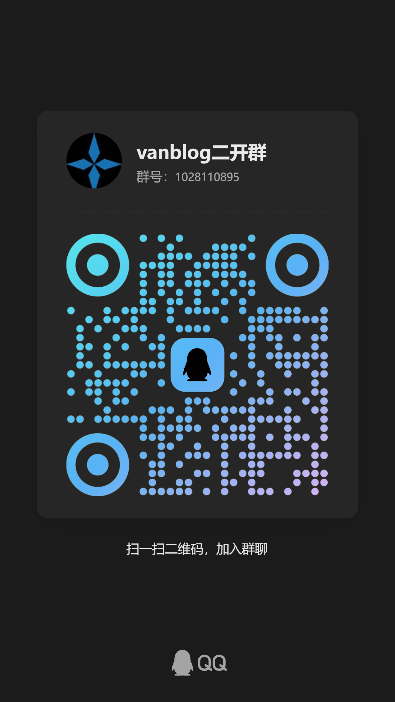

# VanBlog

这个仓库最初源于 VanBlog，现在已经作为我独立维护的博客项目持续更新。当前部署方式已经完全切换为 **Docker Compose 多容器架构**，文档、脚本和发布流程都以本仓库为准。

现在仓库默认提供两种使用方式：

- **源码部署**：用 `docker-compose.yml` 从当前仓库直接构建并启动
- **镜像部署**：用 `docker-compose.image.yml` 拉取已经发布的多镜像版本启动

当前默认维护分支是 `master`。如果你从 GitHub 拉取源码或引用仓库内文档，请统一以 `master` 为准。

项目沿用 `GPL-3.0`；保留对上游 VanBlog 的致谢，但使用、部署与更新请以当前仓库为准。

我的博客地址：<https://www.dong-blog.fun/>

当前仓库开发与发布统一以 `Node.js 24.14.1` + `pnpm 10.33.0` 为基线，根目录也提供了 `.nvmrc` 与 `.node-version` 方便宿主机和 CI 对齐。

## 项目亮点

- 拆分为 `caddy`、`server`、`website`、`admin`、`waline`、`postgres`、`redis` 七个服务
- 后台通过 `http://<host>/admin` 子路径访问，不需要直连 `:3002`
- `postgres`、`redis` 和 Caddy admin API `2019` 默认不暴露到宿主机
- 增加自动化部署测试，覆盖初始化、登录、草稿、发文、前台浏览等主流程
- 支持基于服务名 + 版本 + 镜像 id 的多镜像发布机制

## 整体架构

当前服务划分如下：

| 服务 | 端口 | 说明 |
| --- | --- | --- |
| `caddy` | 80 / 443 | 对外统一入口，负责 `/`、`/admin`、`/api`、评论等转发 |
| `server` | 3000 | NestJS API、Swagger、静态资源 |
| `website` | 3001 / 3011 | Next.js 前台站点与控制端点 |
| `admin` | 3002 | Umi 构建后的后台静态页面 |
| `waline` | 8360 / 8361 | 评论服务与控制端点 |
| `postgres` | 5432 | 主业务数据库，仅在 compose 内部网络访问 |
| `redis` | 6379 | 缓存与队列数据库，仅在 compose 内部网络访问 |

默认访问地址：

- 前台首页：`http://<你的 IP 或域名>/`
- 后台管理：`http://<你的 IP 或域名>/admin`
- API 文档：`http://<你的 IP 或域名>/swagger`
- 评论前台：`http://<你的 IP 或域名>/comment/`

## 快速开始

### 1. 直接从源码启动

```bash
git clone https://github.com/xxddccaa/vanblog.git
cd vanblog
pnpm install
docker compose up -d --build
```

查看日志：

```bash
docker compose logs -f caddy server website admin waline postgres redis
```

首次启动后，请打开：

```text
http://<你的 IP 或域名>/admin/init
```

根据页面提示完成初始化。

停止服务：

```bash
docker compose down
```

如需连数据一起删除：

```bash
docker compose down -v
```

### 2. 使用已发布镜像启动

```bash
export VANBLOG_DOCKER_REPO=kevinchina/deeplearning
export VANBLOG_RELEASE_SUFFIX=v1.0.0-<image-id>

docker compose -f docker-compose.image.yml up -d
```

如果只是临时体验，也可以把 `VANBLOG_RELEASE_SUFFIX` 设成 `latest`，但生产环境更推荐固定到某个不可变发布标签。

## 自动化测试

当前仓库已经补上拆分部署后的自动化测试：

```bash
# 一键完整回归（推荐）
pnpm test:full

# 前台单测
pnpm --filter @vanblog/theme-default test -- --run

# 后端单测
pnpm --filter @vanblog/server test

# 部署配置检查
pnpm test:deploy

# 完整博客流程测试
pnpm test:blog-flow
```

`pnpm test:full` 会顺序执行后端单测、前台单测、admin TypeScript 检查、前后台生产构建、部署配置检查和 compose 端到端流程，适合作为升级、发版、合并前的标准回归命令。

`pnpm test:blog-flow` 会自动验证这些关键路径：

- `/admin -> /admin/` 的跳转是否正确
- 后台 CSS、JS、logo 等静态资源是否能通过 `/admin/` 正常加载
- 初始化博客、后台登录、创建草稿、发布文章
- 前台首页、分类页、标签页、文章页是否能访问到已发布文章
- `postgres`、`redis` 和 Caddy admin `2019` 是否没有被错误暴露

## 开发命令

```bash
pnpm install
pnpm dev
pnpm dev:website
pnpm build
pnpm build:admin
pnpm build:website
```

如果你改动了下面这些内容，建议至少重新执行一次完整回归：

- `/admin` 子路径部署相关代码
- Caddy 路由
- 服务间通信地址
- SSR/SSG 取数逻辑
- Docker / compose 编排

对应命令：

```bash
pnpm test:full
```

## 发布机制

当前推荐使用 **多镜像发布**，而不是旧的单镜像 `kevinchina/deeplearning:vanblog-latest`。

每个服务都会产出类似下面的标签：

```text
kevinchina/deeplearning:vanblog-caddy-v1.0.0-<image-id>
kevinchina/deeplearning:vanblog-server-v1.0.0-<image-id>
kevinchina/deeplearning:vanblog-website-v1.0.0-<image-id>
kevinchina/deeplearning:vanblog-admin-v1.0.0-<image-id>
kevinchina/deeplearning:vanblog-waline-v1.0.0-<image-id>
```

仓库内已经提供：

- `scripts/release-images.sh`：统一构建 / 打 tag / 推送镜像
- `docker-compose.image.yml`：基于已发布镜像部署
- `RELEASE.md`：完整的人工 + AI 发版指南
- `DEPLOY.md`：生产环境拉镜像部署与回滚指南
- `.env.release.example`：生产环境变量模板

常用发版命令：

```bash
# 本地构建镜像
pnpm release:images

# 构建并推送镜像
pnpm release:images:push
```

说明：

- 正式 Docker Hub 发布以本机手工执行为准
- 不再使用 GitHub Actions 自动推送发布镜像

详细说明请看：[`RELEASE.md`](RELEASE.md)

生产部署说明请看：[`DEPLOY.md`](DEPLOY.md)

版本发布说明索引请看：[`docs/releases/README.md`](docs/releases/README.md)

## 文档给 AI 的入口

如果后续让 AI 帮你维护这个仓库，优先让它先读：

- [`README.md`](README.md)
- [`RELEASE.md`](RELEASE.md)
- [`DEPLOY.md`](DEPLOY.md)
- [`AGENTS.md`](AGENTS.md)
- [`CLAUDE.md`](CLAUDE.md)

这样 AI 更容易理解：

- 当前是多容器部署，不再是旧单容器结构
- `/admin` 必须走 Caddy 子路径代理
- 生产部署推荐使用 `docker-compose.image.yml`
- 发版默认使用 `scripts/release-images.sh`

## 当前维护方向

这份仓库是基于自己的使用习惯持续修改的，主要方向包括：

- 管理后台列表和分页体验优化
- 前台分类导航和代码块展示优化
- Mermaid / LaTeX / 私密文档 / 搜索 / 音乐 / 隐私设置等能力增强
- 评论系统默认关闭、Waline 修复
- 浏览量、联系方式、动画效果、标签机制、渲染机制等调整

如果你只关心部署，可以先忽略这些功能层修改，优先看架构、测试和发版文档。

## 交流群

可以进群提 BUG 或交流功能点：


